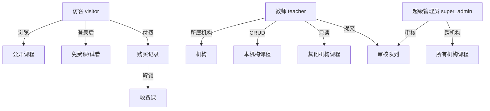

# 学成在线 xuechengPlus3 - 代码检查与迁移清单（理想设计版）

> 配合 **24-新同学版本理解的设计和测试内容.md** 使用
> 生成日期：2026-03-16
> 版本：v3.0-ideal-design

---

## 目录

1. [核心设计理念](#一核心设计理念)
2. [领域模型设计](#二领域模型设计)
3. [状态机设计](#三状态机设计)
4. [后端代码结构](#四后端代码结构)
5. [前端代码结构](#五前端代码结构)
6. [数据库迁移](#六数据库迁移)
7. [检查清单](#七检查清单)
8. [测试验证](#八测试验证)

---

## 一、核心设计理念

### 1.1 设计原则

| 原则 | 说明 | 体现 |
|------|------|------|
| **单一职责** | 每个类/模块只做一件事 | Service分离、状态机独立 |
| **开闭原则** | 对扩展开放，对修改关闭 | 策略模式处理状态流转 |
| **依赖倒置** | 依赖抽象而非具体 | 面向接口编程 |
| **领域驱动** | 代码反映业务语义 | 领域对象、值对象、领域事件 |

### 1.2 核心业务概念

```
┌─────────────────────────────────────────────────────────────┐
│                        学成在线领域模型                        │
├─────────────────────────────────────────────────────────────┤
│                                                             │
│  ┌─────────┐    ┌──────────┐    ┌─────────────┐            │
│  │ 机构    │───▶│ 课程     │───▶│ 教学计划     │            │
│  │ Company │    │ Course   │    │ Teachplan   │            │
│  └─────────┘    └──────────┘    └─────────────┘            │
│       │              │                    │                 │
│       │              ▼                    ▼                 │
│       │         ┌──────────┐        ┌─────────────┐        │
│       │         │ 营销信息 │        │ 媒资关联     │        │
│       │         │ Market   │        │ Media       │        │
│       │         └──────────┘        └─────────────┘        │
│       │              │                                      │
│       │              ▼                                      │
│       │         ┌─────────────────────────────────────┐     │
│       │         │          状态机                      │     │
│       │         │  000 ─100─ 111                      │     │
│       │         │       │    │                        │     │
│       │         │       112  ←──────┐                 │     │
│       │         └─────────────────────────────────────┘     │
│       │              │                    │                 │
│       │              ▼                    ▼                 │
│       │         ┌──────────┐        ┌─────────────┐        │
│       └────────▶│ 审核     │        │ 站内信       │        │
│                 │ Audit    │        │ Message     │        │
│                 └──────────┘        └─────────────┘        │
│                                                             │
│  ┌─────────┐    ┌──────────┐    ┌─────────────┐            │
│  │ 用户    │───▶│ 角色     │───▶│ 权限         │            │
│  │ User    │    │ Role     │    │ Permission   │            │
│  └─────────┘    └──────────┘    └─────────────┘            │
└─────────────────────────────────────────────────────────────┘
```

### 1.3 角色权限模型



---

## 二、领域模型设计

### 2.1 聚合根设计

```java
/**
 * 课程聚合根
 * 负责维护课程的一致性边界和状态流转规则
 */
@Entity
@Table(name = "course_base")
public class Course {

    @Id
    private Long id;

    private Long companyId;
    private String name;

    // ========== 核心状态 ==========
    /**
     * 课程状态：000草稿 / 100待审核 / 111已发布 / 112已下架
     * 这是一个值对象，不直接暴露给外部修改
     */
    @Embedded
    private CourseStatus status;

    // ========== 关联聚合 ==========
    @Embedded
    private CourseMarket market;

    @OneToMany(cascade = CascadeType.ALL, mappedBy = "course")
    private List<CourseTeacher> teachers;

    @OneToMany(cascade = CascadeType.ALL, mappedBy = "course")
    private List<Teachplan> teachplans;

    // ========== 领域行为 ==========
    /**
     * 提交审核
     * @param userId 提交人ID
     * @throws IllegalStateException 当前状态不允许提交
     */
    public void submitForAudit(Long userId) {
        if (!this.status.canSubmit()) {
            throw new IllegalStateException(
                "当前状态 " + this.status.getCode() + " 不允许提交审核"
            );
        }
        CourseStatus oldStatus = this.status;
        this.status = CourseStatus.pending();
        // 发布领域事件
        DomainEvents.publish(new CourseSubmittedEvent(this.id, this.companyId, userId, oldStatus));
    }

    /**
     * 审核
     * @param action 审核动作
     * @param auditorId 审核人ID
     */
    public void audit(AuditAction action, Long auditorId) {
        if (!this.status.isPending()) {
            throw new IllegalStateException("只有待审核状态才能审核");
        }
        CourseStatus oldStatus = this.status;
        this.status = this.status.applyAudit(action);
        // 发布领域事件
        DomainEvents.publish(new CourseAuditedEvent(
            this.id, this.companyId, this.createBy, auditorId,
            action, oldStatus, this.status
        ));
    }

    /**
     * 检查用户是否有权限访问该课程
     * @param user 用户上下文
     * @return 访问权限结果
     */
    public AccessResult checkAccess(UserContext user) {
        return switch (this.status.getCode()) {
            case "111" -> this.checkPublishedAccess(user);
            case "000", "100" -> AccessResult.notFound("课程未发布");
            case "112" -> AccessResult.forbidden("课程已下架");
            default -> AccessResult.forbidden("未知状态");
        };
    }

    private AccessResult checkPublishedAccess(UserContext user) {
        if (this.market.isFree()) {
            return AccessResult.allowed();
        }
        if (!user.isAuthenticated()) {
            return AccessResult.loginRequired();
        }
        if (user.hasPurchased(this.id)) {
            return AccessResult.allowed();
        }
        return AccessResult.purchaseRequired();
    }

    // ========== 查询方法 ==========
    public boolean isDraft() { return "000".equals(this.status.getCode()); }
    public boolean isPending() { return "100".equals(this.status.getCode()); }
    public boolean isPublished() { return "111".equals(this.status.getCode()); }
    public boolean isBanned() { return "112".equals(this.status.getCode()); }
    public boolean belongsTo(Long companyId) { return this.companyId.equals(companyId); }
}
```

### 2.2 值对象设计

```java
/**
 * 课程状态值对象
 * 不可变，保证状态一致性
 */
@Embeddable
public final class CourseStatus {

    public static final CourseStatus DRAFT = new CourseStatus("000", "草稿");
    public static final CourseStatus PENDING = new CourseStatus("100", "待审核");
    public static final CourseStatus PUBLISHED = new CourseStatus("111", "已发布");
    public static final CourseStatus BANNED = new CourseStatus("112", "已下架");

    private final String code;
    private final String description;

    // 构造函数私有化，强制使用静态工厂
    private CourseStatus(String code, String description) {
        this.code = code;
        this.description = description;
    }

    public static CourseStatus of(String code) {
        return switch (code) {
            case "000" -> DRAFT;
            case "100" -> PENDING;
            case "111" -> PUBLISHED;
            case "112" -> BANNED;
            default -> throw new IllegalArgumentException("无效状态码: " + code);
        };
    }

    public static CourseStatus draft() { return DRAFT; }
    public static CourseStatus pending() { return PENDING; }
    public static CourseStatus published() { return PUBLISHED; }
    public static CourseStatus banned() { return BANNED; }

    // ========== 状态断言 ==========
    public boolean canSubmit() { return this == DRAFT; }
    public boolean isPending() { return this == PENDING; }
    public boolean isPublished() { return this == PUBLISHED; }
    public boolean canModify() { return this == DRAFT || this == PENDING; }
    public boolean isVisibleToPublic() { return this == PUBLISHED; }

    // ========== 状态转换 ==========
    public CourseStatus submit() {
        if (!canSubmit()) {
            throw new IllegalStateException("只有草稿状态才能提交审核");
        }
        return PENDING;
    }

    public CourseStatus applyAudit(AuditAction action) {
        if (!isPending()) {
            throw new IllegalStateException("只有待审核状态才能审核");
        }
        return switch (action) {
            case APPROVE -> PUBLISHED;
            case REJECT -> DRAFT;
            case BAN -> BANNED;
        };
    }

    // Getters
    public String getCode() { return code; }
    public String getDescription() { return description; }
}

/**
 * 审核动作枚举
 */
public enum AuditAction {
    APPROVE("审核通过"),
    REJECT("退回修改"),
    BAN("永久下架");

    private final String description;

    AuditAction(String description) {
        this.description = description;
    }
}

/**
 * 访问结果值对象
 */
public final class AccessResult {
    private final boolean allowed;
    private final String reason;

    private static final AccessResult ALLOWED = new AccessResult(true, null);

    private AccessResult(boolean allowed, String reason) {
        this.allowed = allowed;
        this.reason = reason;
    }

    public static AccessResult allowed() { return ALLOWED; }
    public static AccessResult notFound(String reason) { return new AccessResult(false, reason); }
    public static AccessResult forbidden(String reason) { return new AccessResult(false, reason); }
    public static AccessResult loginRequired() { return new AccessResult(false, "请先登录"); }
    public static AccessResult purchaseRequired() { return new AccessResult(false, "请购买课程"); }

    public boolean isAllowed() { return allowed; }
    public String getReason() { return reason; }
}
```

### 2.3 领域事件设计

```java
/**
 * 课程领域事件基类
 */
public abstract class CourseEvent {
    private final Long courseId;
    private final LocalDateTime occurredOn;

    protected CourseEvent(Long courseId) {
        this.courseId = courseId;
        this.occurredOn = LocalDateTime.now();
    }
}

/**
 * 课程提交审核事件
 * → 触发站内信给所有 super_admin
 */
public class CourseSubmittedEvent extends CourseEvent {
    private final Long companyId;
    private final Long submitterId;
    private final CourseStatus oldStatus;

    public CourseSubmittedEvent(Long courseId, Long companyId,
                                Long submitterId, CourseStatus oldStatus) {
        super(courseId);
        this.companyId = companyId;
        this.submitterId = submitterId;
        this.oldStatus = oldStatus;
    }
}

/**
 * 课程审核完成事件
 * → 触发站内信给课程创建者
 * → 触发审核日志记录
 */
public class CourseAuditedEvent extends CourseEvent {
    private final Long companyId;
    private final Long teacherId;
    private final Long auditorId;
    private final AuditAction action;
    private final String opinion;
    private final CourseStatus oldStatus;
    private final CourseStatus newStatus;

    public CourseAuditedEvent(Long courseId, Long companyId, Long teacherId,
                              Long auditorId, AuditAction action,
                              CourseStatus oldStatus, CourseStatus newStatus) {
        super(courseId);
        this.companyId = companyId;
        this.teacherId = teacherId;
        this.auditorId = auditorId;
        this.action = action;
        this.oldStatus = oldStatus;
        this.newStatus = newStatus;
        this.opinion = null;
    }
}
```

---

## 三、状态机设计

### 3.1 状态转换图

```
                    ┌─────────────────────────────────────────┐
                    │                                         │
                    │         提交审核 (submit)                │
                    │    ┌─────────────────────────────┐       │
                    ▼    ▼                             │       │
┌─────────┐   submit   ┌─────────┐   审核通过(approve)  ┌─────────┐
│   000   │ ─────────▶ │   100   │ ─────────────────▶ │   111   │
│  草稿   │            │ 待审核  │                     │  已发布 │
└─────────┘            └─────────┘                     └─────────┘
    ▲                        │                                 │
    │                        │                                 │
    │                        │ 审核退回(reject)                │ 申请下架
    │                        ▼                                 │
    │                   ┌─────────┐                            │
    │                   │   000   │ ◄─────────────────────────┘
    │                   │  草稿   │
    │                   └─────────┘
    │                        │
    │                        │ 审核封禁(ban)
    │                        ▼
    │                   ┌─────────┐
    └───────────────────│   112   │
       修改后可重新提交    │  已下架 │
                        └─────────┘
```

### 3.2 状态机实现（策略模式）

```java
/**
 * 状态机服务
 * 封装所有状态转换逻辑
 */
@Service
public class CourseStateMachine {

    private final Map<String, StateHandler> handlers;
    private final MessageService messageService;
    private final AuditLogService auditLogService;

    public CourseStateMachine(MessageService messageService,
                              AuditLogService auditLogService) {
        this.messageService = messageService;
        this.auditLogService = auditLogService;
        this.handlers = Map.of(
            "000", new DraftStateHandler(),
            "100", new PendingStateHandler(),
            "111", new PublishedStateHandler(),
            "112", new BannedStateHandler()
        );
    }

    /**
     * 执行状态转换
     * @param course 课程
     * @param action 动作
     * @param context 上下文
     * @return 新状态
     */
    public CourseStatus transition(Course course, String action, TransitionContext context) {
        StateHandler handler = handlers.get(course.getStatus().getCode());
        if (handler == null) {
            throw new IllegalStateException("未知状态: " + course.getStatus().getCode());
        }
        return handler.execute(course, action, context);
    }

    /**
     * 状态处理器接口
     */
    private interface StateHandler {
        CourseStatus execute(Course course, String action, TransitionContext context);
    }

    /**
     * 草稿状态处理器
     */
    private class DraftStateHandler implements StateHandler {
        @Override
        public CourseStatus execute(Course course, String action, TransitionContext context) {
            return switch (action) {
                case "submit" -> {
                    // 发送站内信给所有 super_admin
                    messageService.sendToAllSuperAdmin(
                        MessageType.COURSE_SUBMIT,
                        "新课程待审核",
                        String.format("机构【%s】提交了新课程《%s》",
                            course.getCompanyName(), course.getName()),
                        course.getId()
                    );
                    // 记录审核日志
                    auditLogService.record(course, "submit", null, context.getUserId());
                    yield CourseStatus.pending();
                }
                default -> throw new IllegalStateException("草稿状态只能执行提交操作");
            };
        }
    }

    /**
     * 待审核状态处理器
     */
    private class PendingStateHandler implements StateHandler {
        @Override
        public CourseStatus execute(Course course, String action, TransitionContext context) {
            return switch (action) {
                case "approve" -> {
                    // 发送审核通过通知
                    messageService.sendToUser(
                        course.getCreateBy(),
                        MessageType.AUDIT_APPROVED,
                        "课程审核通过",
                        String.format("您的课程《%s》已审核通过并发布", course.getName()),
                        course.getId()
                    );
                    auditLogService.record(course, "approve", "审核通过", context.getUserId());
                    yield CourseStatus.published();
                }
                case "reject" -> {
                    // 发送退回通知（附带审核意见）
                    messageService.sendToUser(
                        course.getCreateBy(),
                        MessageType.AUDIT_REJECTED,
                        "课程审核退回",
                        String.format("您的课程《%s》已退回，意见：%s",
                            course.getName(), context.getOpinion()),
                        course.getId()
                    );
                    auditLogService.record(course, "reject", context.getOpinion(), context.getUserId());
                    yield CourseStatus.draft();
                }
                case "ban" -> {
                    // 发送封禁通知
                    messageService.sendToUser(
                        course.getCreateBy(),
                        MessageType.AUDIT_BANNED,
                        "课程已下架",
                        String.format("您的课程《%s》已被永久下架，不再接受审核", course.getName()),
                        course.getId()
                    );
                    auditLogService.record(course, "ban", "永久下架", context.getUserId());
                    yield CourseStatus.banned();
                }
                default -> throw new IllegalStateException("无效的审核操作");
            };
        }
    }

    /**
     * 已发布状态处理器
     */
    private class PublishedStateHandler implements StateHandler {
        @Override
        public CourseStatus execute(Course course, String action, TransitionContext context) {
            return switch (action) {
                case "offline" -> {
                    // 机构申请下架
                    messageService.sendToAllSuperAdmin(
                        MessageType.COURSE_OFFLINE,
                        "课程下架申请",
                        String.format("机构【%s】申请下架课程《%s》",
                            course.getCompanyName(), course.getName()),
                        course.getId()
                    );
                    auditLogService.record(course, "offline", "机构申请下架", context.getUserId());
                    yield CourseStatus.banned();
                }
                case "modify_submit" -> {
                    // 已发布课程修改后重新提交审核
                    messageService.sendToAllSuperAdmin(
                        MessageType.COURSE_SUBMIT,
                        "课程修订待审核",
                        String.format("机构【%s】修改了已发布课程《%s》，请重新审核",
                            course.getCompanyName(), course.getName()),
                        course.getId()
                    );
                    auditLogService.record(course, "modify_submit", "修订提交", context.getUserId());
                    yield CourseStatus.pending();
                }
                default -> throw new IllegalStateException("已发布状态无效操作");
            };
        }
    }

    /**
     * 已下架状态处理器
     */
    private class BannedStateHandler implements StateHandler {
        @Override
        public CourseStatus execute(Course course, String action, TransitionContext context) {
            // 已下架状态不允许任何转换（永久下架）
            throw new IllegalStateException("已下架课程不允许状态变更");
        }
    }

    /**
     * 转换上下文
     */
    @Data
    @AllArgsConstructor
    public static class TransitionContext {
        private Long userId;      // 操作人ID
        private String opinion;   // 审核意见（可选）
    }
}
```

---

## 四、后端代码结构

### 4.1 理想目录结构（DDD风格）

```
c-plus-content-service/
├── src/main/java/com/xuecheng/content/
│   ├── domain/                    # 领域层
│   │   ├── course/                # 课程聚合
│   │   │   ├── Course.java        # 聚合根
│   │   │   ├── CourseStatus.java  # 值对象
│   │   │   ├── CourseMarket.java  # 值对象
│   │   │   ├── CourseTeacher.java # 实体
│   │   │   ├── Teachplan.java     # 实体
│   │   │   ├── CourseRepository.java # 仓储接口
│   │   │   └── event/             # 领域事件
│   │   │       ├── CourseEvent.java
│   │   │       ├── CourseSubmittedEvent.java
│   │   │       └── CourseAuditedEvent.java
│   │   ├── audit/                 # 审核聚合
│   │   │   ├── AuditLog.java
│   │   │   └── AuditLogRepository.java
│   │   ├── message/               # 站内信聚合
│   │   │   ├── SystemMessage.java
│   │   │   ├── MessageType.java
│   │   │   └── MessageRepository.java
│   │   ├── user/                  # 用户聚合
│   │   │   ├── User.java
│   │   │   ├── UserRole.java
│   │   │   └── UserRepository.java
│   │   ├── shared/                # 共享内核
│   │   │   ├── valueobject/       # 值对象
│   │   │   │   ├── CompanyId.java
│   │   │   │   └── AccessResult.java
│   │   │   ├── specification/     # 规约模式
│   │   │   │   ├── CourseAccessSpec.java
│   │   │   │   └── CourseOwnershipSpec.java
│   │   │   └── exception/         # 领域异常
│   │   │       ├── CourseNotFoundException.java
│   │   │       └── InvalidStatusTransitionException.java
│   │   └── DomainEvents.java     # 领域事件发布器
│   │
│   ├── application/               # 应用层
│   │   ├── service/               # 应用服务
│   │   │   ├── CourseApplicationService.java
│   │   │   ├── AuditApplicationService.java
│   │   │   └── MessageApplicationService.java
│   │   ├── command/               # 命令对象
│   │   │   ├── CreateCourseCommand.java
│   │   │   ├── SubmitCourseCommand.java
│   │   │   ├── AuditCourseCommand.java
│   │   │   └── UpdateCourseCommand.java
│   │   ├── query/                 # 查询对象
│   │   │   ├── CourseQuery.java
│   │   │   └── AuditQuery.java
│   │   └── facade/                # 门面服务（编排）
│   │       └── CourseOrchestrationService.java
│   │
│   ├── infrastructure/            # 基础设施层
│   │   ├── persistence/           # 持久化
│   │   │   ├── mapper/
│   │   │   │   ├── CourseBaseMapper.java
│   │   │   │   ├── SystemMessageMapper.java
│   │   │   │   └── CourseAuditLogMapper.java
│   │   │   ├── converter/         # 转换器
│   │   │   │   └── CourseConverter.java
│   │   │   └── po/                # 持久化对象
│   │   │       └── CourseBasePO.java
│   │   ├── messaging/             # 消息/事件
│   │   │   ├── EventPublisher.java
│   │   │   └── MessageEventHandler.java
│   │   └── security/              # 安全
│   │       ├── UserContext.java
│   │       ├── UserContextHolder.java
│   │       └── PermissionService.java
│   │
│   ├── interfaces/                # 接口层
│   │   ├── rest/                  # REST控制器
│   │   │   ├── CourseController.java
│   │   │   ├── AuditController.java
│   │   │   └── MessageController.java
│   │   ├── dto/                   # 数据传输对象
│   │   │   ├── request/
│   │   │   │   ├── CourseCreateRequest.java
│   │   │   │   ├── CourseAuditRequest.java
│   │   │   │   └── CourseUpdateRequest.java
│   │   │   └── response/
│   │   │       ├── CourseResponse.java
│   │   │       └── AuditLogResponse.java
│   │   └── assembler/             # 组装器（DTO↔Domain）
│   │       └── CourseAssembler.java
│   │
│   └── common/                    # 通用组件
│       ├── RestResponse.java      # 统一响应
│       ├── PageResult.java        # 分页结果
│       └── enums/                 # 枚举
│           ├── AuditActionEnum.java
│           ├── CourseStatusEnum.java
│           └── MessageTypeEnum.java
│
└── src/main/resources/
    ├── mapper/                    # MyBatis XML
    │   ├── CourseBaseMapper.xml
    │   ├── SystemMessageMapper.xml
    │   └── CourseAuditLogMapper.xml
    └── initSql/                   # 初始化SQL
        └── v3_new_student_init.sql
```

### 4.2 Controller 层设计

```java
/**
 * 课程控制器
 * 职责：接收HTTP请求，参数校验，调用应用服务，返回响应
 */
@RestController
@RequestMapping("/api/courses")
@Tag(name = "课程管理")
@RequiredArgsConstructor
public class CourseController {

    private final CourseApplicationService courseAppService;
    private final UserContext userContext;

    /**
     * 创建课程（草稿）
     */
    @PostMapping
    @PreAuthorize("hasRole('TEACHER')")
    @Operation(summary = "创建课程")
    public RestResponse<CourseResponse> create(
        @Valid @RequestBody CourseCreateRequest request) {
        Long companyId = userContext.getRequiredCompanyId();
        Long userId = userContext.getRequiredUserId();
        CourseResponse response = courseAppService.createCourse(request, companyId, userId);
        return RestResponse.success(response);
    }

    /**
     * 提交审核
     */
    @PostMapping("/{id}/submit")
    @PreAuthorize("hasRole('TEACHER')")
    @Operation(summary = "提交审核")
    public RestResponse<Void> submit(@PathVariable Long id) {
        Long userId = userContext.getRequiredUserId();
        Long companyId = userContext.getRequiredCompanyId();
        courseAppService.submitForAudit(id, companyId, userId);
        return RestResponse.success();
    }

    /**
     * 获取课程详情（公开接口）
     */
    @GetMapping("/{id}")
    @Operation(summary = "课程详情")
    public RestResponse<CourseDetailResponse> getDetail(@PathVariable Long id) {
        UserContext user = UserContextHolder.get();
        CourseDetailResponse response = courseAppService.getCourseDetail(id, user);
        return RestResponse.success(response);
    }

    /**
     * 检查媒资访问权限
     */
    @GetMapping("/{id}/media-access")
    @Operation(summary = "检查媒资访问权限")
    public RestResponse<MediaAccessResponse> checkMediaAccess(
        @PathVariable Long id,
        @RequestParam Long teachplanId) {
        UserContext user = UserContextHolder.get();
        MediaAccessResponse response = courseAppService.checkMediaAccess(id, teachplanId, user);
        return RestResponse.success(response);
    }
}

/**
 * 审核控制器（SuperAdmin专用）
 */
@RestController
@RequestMapping("/api/admin/audit")
@Tag(name = "课程审核")
@PreAuthorize("hasRole('SUPER_ADMIN')")
@RequiredArgsConstructor
public class AuditController {

    private final AuditApplicationService auditService;
    private final UserContext userContext;

    /**
     * 待审核列表
     */
    @GetMapping("/pending")
    @Operation(summary = "待审核课程列表")
    public RestResponse<PageResult<CourseAuditItem>> getPending(
        @RequestParam(defaultValue = "1") int page,
        @RequestParam(defaultValue = "10") int size) {
        PageResult<CourseAuditItem> response = auditService.getPendingCourses(page, size);
        return RestResponse.success(response);
    }

    /**
     * 审核操作
     */
    @PostMapping("/courses/{id}")
    @Operation(summary = "审核课程")
    public RestResponse<Void> audit(
        @PathVariable Long id,
        @Valid @RequestBody CourseAuditRequest request) {
        Long auditorId = userContext.getRequiredUserId();
        auditService.auditCourse(id, request, auditorId);
        return RestResponse.success();
    }

    /**
     * 审核历史
     */
    @GetMapping("/courses/{id}/history")
    @Operation(summary = "审核历史")
    public RestResponse<List<AuditLogResponse>> getHistory(@PathVariable Long id) {
        List<AuditLogResponse> response = auditService.getAuditHistory(id);
        return RestResponse.success(response);
    }
}

/**
 * 站内信控制器
 */
@RestController
@RequestMapping("/api/messages")
@Tag(name = "站内信")
@RequiredArgsConstructor
public class MessageController {

    private final MessageApplicationService messageService;
    private final UserContext userContext;

    /**
     * 消息列表
     */
    @GetMapping
    @PreAuthorize("isAuthenticated()")
    @Operation(summary = "消息列表")
    public RestResponse<PageResult<MessageResponse>> getMessages(
        @RequestParam(defaultValue = "1") int page,
        @RequestParam(defaultValue = "20") int size,
        @RequestParam(required = false) Boolean unreadOnly) {
        Long userId = userContext.getRequiredUserId();
        PageResult<MessageResponse> response = messageService.getUserMessages(userId, page, size, unreadOnly);
        return RestResponse.success(response);
    }

    /**
     * 未读数量
     */
    @GetMapping("/unread-count")
    @PreAuthorize("isAuthenticated()")
    @Operation(summary = "未读数量")
    public RestResponse<Integer> getUnreadCount() {
        Long userId = userContext.getRequiredUserId();
        int count = messageService.getUnreadCount(userId);
        return RestResponse.success(count);
    }

    /**
     * 标记已读
     */
    @PutMapping("/{id}/read")
    @PreAuthorize("isAuthenticated()")
    @Operation(summary = "标记已读")
    public RestResponse<Void> markAsRead(@PathVariable Long id) {
        Long userId = userContext.getRequiredUserId();
        messageService.markAsRead(id, userId);
        return RestResponse.success();
    }

    /**
     * 全部标记已读
     */
    @PutMapping("/read-all")
    @PreAuthorize("isAuthenticated()")
    @Operation(summary = "全部标记已读")
    public RestResponse<Void> markAllAsRead() {
        Long userId = userContext.getRequiredUserId();
        messageService.markAllAsRead(userId);
        return RestResponse.success();
    }
}
```

### 4.3 Service 层设计

```java
/**
 * 课程应用服务
 * 职责：编排领域对象，处理事务，协调基础设施
 */
@Service
@RequiredArgsConstructor
public class CourseApplicationService {

    private final CourseRepository courseRepository;
    private final TeachplanRepository teachplanRepository;
    private final CourseStateMachine stateMachine;
    private final CourseAssembler courseAssembler;

    @Transactional
    public CourseResponse createCourse(CourseCreateRequest request, Long companyId, Long userId) {
        // 1. 创建聚合根
        Course course = Course.create(
            companyId,
            request.getName(),
            request.getMt(),
            request.getSt(),
            userId
        );

        // 2. 保存聚合
        courseRepository.save(course);

        // 3. 返回响应
        return courseAssembler.toResponse(course);
    }

    @Transactional
    public void submitForAudit(Long courseId, Long companyId, Long userId) {
        // 1. 获取课程
        Course course = courseRepository.findById(courseId)
            .orElseThrow(() -> new CourseNotFoundException(courseId));

        // 2. 权限检查（规约模式）
        new CourseOwnershipSpec(companyId).check(course);

        // 3. 状态转换
        CourseStateMachine.TransitionContext context =
            new CourseStateMachine.TransitionContext(userId, null);
        CourseStatus newStatus = stateMachine.transition(course, "submit", context);

        // 4. 更新课程
        course.setStatus(newStatus);
        courseRepository.save(course);
    }

    @Transactional(readOnly = true)
    public CourseDetailResponse getCourseDetail(Long courseId, UserContext user) {
        Course course = courseRepository.findByIdWithRelations(courseId)
            .orElseThrow(() -> new CourseNotFoundException(courseId));

        // 访问权限检查
        AccessResult access = course.checkAccess(user);
        if (!access.isAllowed()) {
            throw new AccessDeniedException(access.getReason());
        }

        return courseAssembler.toDetailResponse(course);
    }

    @Transactional(readOnly = true)
    public MediaAccessResponse checkMediaAccess(Long courseId, Long teachplanId, UserContext user) {
        Course course = courseRepository.findById(courseId)
            .orElseThrow(() -> new CourseNotFoundException(courseId));
        Teachplan teachplan = teachplanRepository.findById(teachplanId)
            .orElseThrow(() -> new TeachplanNotFoundException(teachplanId));

        // 检查课程访问权限
        AccessResult courseAccess = course.checkAccess(user);
        if (!courseAccess.isAllowed()) {
            return MediaAccessResponse.denied(courseAccess.getReason());
        }

        // 检查试看权限
        if (teachplan.isPreviewEnabled()) {
            return MediaAccessResponse.allowed();
        }

        // 检查购买权限
        if (user.hasPurchased(courseId)) {
            return MediaAccessResponse.allowed();
        }

        return MediaAccessResponse.denied("请购买课程后观看");
    }
}

/**
 * 审核应用服务
 */
@Service
@RequiredArgsConstructor
public class AuditApplicationService {

    private final CourseRepository courseRepository;
    private final CourseStateMachine stateMachine;
    private final AuditLogRepository auditLogRepository;
    private final MessageService messageService;

    @Transactional
    public void auditCourse(Long courseId, CourseAuditRequest request, Long auditorId) {
        // 1. 获取课程
        Course course = courseRepository.findById(courseId)
            .orElseThrow(() -> new CourseNotFoundException(courseId));

        // 2. 状态转换
        CourseStateMachine.TransitionContext context =
            new CourseStateMachine.TransitionContext(auditorId, request.getOpinion());
        CourseStatus newStatus = stateMachine.transition(course, request.getAction(), context);

        // 3. 更新课程
        course.setStatus(newStatus);
        courseRepository.save(course);

        // 4. 审核日志和站内信由状态机内部处理
    }

    @Transactional(readOnly = true)
    public PageResult<CourseAuditItem> getPendingCourses(int page, int size) {
        PageResult<Course> courses = courseRepository.findByStatus("100", page, size);
        return courses.map(this::toAuditItem);
    }

    @Transactional(readOnly = true)
    public List<AuditLogResponse> getAuditHistory(Long courseId) {
        List<AuditLog> logs = auditLogRepository.findByCourseId(courseId);
        return logs.stream()
            .map(this::toAuditLogResponse)
            .toList();
    }
}

/**
 * 站内信应用服务
 */
@Service
@RequiredArgsConstructor
public class MessageApplicationService {

    private final MessageRepository messageRepository;
    private final MessageAssembler messageAssembler;

    @Transactional(readOnly = true)
    public PageResult<MessageResponse> getUserMessages(Long userId, int page, int size, Boolean unreadOnly) {
        if (Boolean.TRUE.equals(unreadOnly)) {
            return messageRepository.findUnreadByUserId(userId, page, size)
                .map(messageAssembler::toResponse);
        }
        return messageRepository.findByUserId(userId, page, size)
            .map(messageAssembler::toResponse);
    }

    @Transactional(readOnly = true)
    public int getUnreadCount(Long userId) {
        return messageRepository.countUnreadByUserId(userId);
    }

    @Transactional
    public void markAsRead(Long messageId, Long userId) {
        SystemMessage message = messageRepository.findById(messageId)
            .orElseThrow(() -> new MessageNotFoundException(messageId));
        if (!message.isToUser(userId)) {
            throw new AccessDeniedException("无权操作此消息");
        }
        message.markAsRead();
        messageRepository.save(message);
    }

    @Transactional
    public void markAllAsRead(Long userId) {
        messageRepository.markAllAsReadByUserId(userId);
    }
}
```

---

## 五、前端代码结构

### 5.1 理想目录结构

```
frontend/src/
├── api/                       # API调用层
│   ├── request.ts            # axios封装
│   ├── auth.ts               # 认证API
│   ├── content/
│   │   ├── course.ts         # 课程API
│   │   ├── teachplan.ts      # 教学计划API
│   │   ├── category.ts       # 分类API
│   │   ├── market.ts         # 营销API
│   │   ├── teacher.ts        # 教师API
│   │   ├── media.ts          # 媒资API
│   │   └── archive.ts        # 备案API
│   ├── audit.ts              # 审核API（新增）
│   └── message.ts            # 站内信API（新增）
│
├── types/                     # TypeScript类型定义
│   ├── content.ts            # 课程相关类型
│   ├── audit.ts              # 审核相关类型（新增）
│   ├── message.ts            # 站内信相关类型（新增）
│   ├── auth.ts               # 认证相关类型
│   └── common.ts             # 通用类型
│
├── stores/                    # Pinia状态管理
│   ├── auth.ts               # 认证状态
│   ├── message.ts            # 站内信状态（新增）
│   └── course.ts             # 课程编辑状态
│
├── router/                    # Vue Router配置
│   ├── index.ts              # 路由定义
│   └── guards.ts             # 路由守卫
│
├── views/                     # 页面组件
│   ├── HomeView.vue          # 首页
│   ├── LoginView.vue         # 登录
│   ├── CourseListPublicView.vue  # 公开课程列表
│   ├── CourseDetailView.vue  # 课程详情
│   ├── CoursePlayView.vue    # 课程播放
│   ├── CoursePreviewView.vue # 课程预览
│   ├── CoursesView.vue       # 课程管理（teacher）
│   ├── CourseEditView.vue    # 课程编辑
│   ├── TeachplanView.vue     # 教学计划编辑
│   ├── MediaUploadView.vue   # 媒资管理
│   ├── ArchiveManageView.vue # 备案管理
│   ├── AuditView.vue         # 审核页面（super_admin，新增）
│   └── MessageCenterView.vue # 站内信中心（新增）
│
├── components/                # 可复用组件
│   ├── CoursePicUpload.vue   # 封面上传
│   ├── MediaUploader.vue     # 媒资上传
│   ├── TeachplanTree.vue     # 教学计划树
│   ├── StatusBadge.vue       # 状态徽章（新增）
│   ├── MessageNotification.vue # 消息通知（新增）
│   └── AccessControl.vue     # 访问控制组件（新增）
│
├── composables/               # 组合式函数
│   ├── useAuth.ts            # 认证相关
│   ├── useCourse.ts          # 课程相关
│   ├── usePermission.ts      # 权限检查（新增）
│   ├── useMessage.ts         # 站内信相关（新增）
│   └── useAccessControl.ts   # 访问控制（新增）
│
├── layouts/                   # 布局组件
│   └── Layout.vue            # 主布局
│
├── utils/                     # 工具函数
│   ├── validation.ts         # 表单验证
│   ├── format.ts             # 格式化
│   └── constants.ts          # 常量定义（新增）
│
├── styles/                    # 样式文件
│   └── main.css
│
├── App.vue                    # 根组件
└── main.ts                    # 入口文件
```

### 5.2 核心类型定义

```typescript
// types/content.ts

/**
 * 课程状态枚举
 */
export enum CourseStatus {
  DRAFT = '000',       // 草稿
  PENDING = '100',     // 待审核
  PUBLISHED = '111',   // 已发布
  BANNED = '112'       // 已下架
}

/**
 * 课程状态元数据
 */
export const CourseStatusMeta: Record<CourseStatus, {
  label: string
  color: string
  icon: string
}> = {
  [CourseStatus.DRAFT]: { label: '草稿', color: 'gray', icon: 'Edit' },
  [CourseStatus.PENDING]: { label: '待审核', color: 'orange', icon: 'Clock' },
  [CourseStatus.PUBLISHED]: { label: '已发布', color: 'green', icon: 'Check' },
  [CourseStatus.BANNED]: { label: '已下架', color: 'red', icon: 'Ban' }
}

/**
 * 课程基础信息
 */
export interface CourseBase {
  id: number
  companyId: number
  companyName: string
  name: string
  courseStatus: CourseStatus
  // ... 其他字段
}

/**
 * 课程详情
 */
export interface CourseDetail extends CourseBase {
  market: CourseMarket
  teachers: CourseTeacher[]
  teachplans: TeachplanTree[]
}

/**
 * 访问权限结果
 */
export interface AccessResult {
  allowed: boolean
  reason?: string
  requireAction?: 'login' | 'purchase'
}

// types/audit.ts

/**
 * 审核动作
 */
export enum AuditAction {
  APPROVE = 'approve',   // 审核通过
  REJECT = 'reject',     // 退回修改
  BAN = 'ban'            // 永久下架
}

/**
 * 审核请求
 */
export interface CourseAuditRequest {
  action: AuditAction
  opinion?: string
}

/**
 * 审核日志
 */
export interface AuditLog {
  id: number
  courseId: number
  courseName: string
  action: AuditAction
  opinion?: string
  auditorName: string
  oldStatus: CourseStatus
  newStatus: CourseStatus
  createTime: string
}

// types/message.ts

/**
 * 消息类型
 */
export enum MessageType {
  COURSE_SUBMIT = 'COURSE_SUBMIT',           // 课程提交
  AUDIT_APPROVED = 'AUDIT_APPROVED',         // 审核通过
  AUDIT_REJECTED = 'AUDIT_REJECTED',         // 审核退回
  AUDIT_BANNED = 'AUDIT_BANNED',             // 永久下架
  COURSE_OFFLINE = 'COURSE_OFFLINE'          // 申请下架
}

/**
 * 站内信
 */
export interface SystemMessage {
  id: number
  type: MessageType
  title: string
  content: string
  courseId?: number
  courseName?: string
  isRead: boolean
  createTime: string
}
```

### 5.3 核心组合式函数

```typescript
// composables/useAccessControl.ts

/**
 * 访问控制组合式函数
 * 处理课程访问权限逻辑
 */
import { computed } from 'vue'
import { useAuth } from './useAuth'
import type { AccessResult, CourseDetail } from '@/types/content'

export function useAccessControl() {
  const { user } = useAuth()

  /**
   * 检查课程访问权限
   */
  const checkCourseAccess = (course: CourseDetail): AccessResult => {
    // 1. 检查课程状态
    if (course.courseStatus !== '111') {
      return {
        allowed: false,
        reason: course.courseStatus === '000' || course.courseStatus === '100'
          ? '课程未发布'
          : '课程已下架'
      }
    }

    // 2. 免费课
    if (course.market.charge === '201000') {
      return { allowed: true }
    }

    // 3. 未登录
    if (!user.value) {
      return { allowed: false, reason: '请先登录', requireAction: 'login' }
    }

    // 4. 已购买
    if (hasPurchasedCourse(course.id)) {
      return { allowed: true }
    }

    // 5. 需要购买
    return { allowed: false, reason: '请购买课程后观看', requireAction: 'purchase' }
  }

  /**
   * 检查章节访问权限
   */
  const checkTeachplanAccess = (
    course: CourseDetail,
    teachplan: Teachplan
  ): AccessResult => {
    // 1. 先检查课程访问权限
    const courseAccess = checkCourseAccess(course)
    if (!courseAccess.allowed) {
      return courseAccess
    }

    // 2. 免费课或已购买，直接通过
    if (course.market.charge === '201000' || hasPurchasedCourse(course.id)) {
      return { allowed: true }
    }

    // 3. 试看章节
    if (teachplan.isPreviewEnabled === '1') {
      return { allowed: true }
    }

    // 4. 需要购买
    return { allowed: false, reason: '请购买课程后观看', requireAction: 'purchase' }
  }

  /**
   * 检查用户是否已购买课程
   */
  const hasPurchasedCourse = (courseId: number): boolean => {
    if (!user.value) return false
    return user.value.purchasedCourses?.includes(courseId) ?? false
  }

  return {
    checkCourseAccess,
    checkTeachplanAccess,
    hasPurchasedCourse
  }
}

// composables/useMessage.ts

/**
 * 站内信组合式函数
 */
import { ref, computed } from 'vue'
import { messageApi } from '@/api/message'
import type { SystemMessage } from '@/types/message'

export function useMessage() {
  const messages = ref<SystemMessage[]>([])
  const unreadCount = ref(0)
  const loading = ref(false)

  /**
   * 获取消息列表
   */
  const fetchMessages = async (unreadOnly = false) => {
    loading.value = true
    try {
      const { data } = await messageApi.list({
        pageNo: 1,
        pageSize: 20,
        unreadOnly
      })
      messages.value = data?.items ?? []
    } finally {
      loading.value = false
    }
  }

  /**
   * 获取未读数量
   */
  const fetchUnreadCount = async () => {
    const { data } = await messageApi.getUnreadCount()
    unreadCount.value = data ?? 0
  }

  /**
   * 标记已读
   */
  const markAsRead = async (messageId: number) => {
    await messageApi.markAsRead(messageId)
    const index = messages.value.findIndex(m => m.id === messageId)
    if (index !== -1) {
      messages.value[index].isRead = true
      unreadCount.value--
    }
  }

  /**
   * 全部标记已读
   */
  const markAllAsRead = async () => {
    await messageApi.markAllAsRead()
    messages.value.forEach(m => m.isRead = true)
    unreadCount.value = 0
  }

  return {
    messages,
    unreadCount,
    loading,
    fetchMessages,
    fetchUnreadCount,
    markAsRead,
    markAllAsRead
  }
}

// composables/usePermission.ts

/**
 * 权限检查组合式函数
 */
import { computed } from 'vue'
import { useAuth } from './useAuth'

export function usePermission() {
  const { user } = useAuth()

  /**
   * 是否是超级管理员
   */
  const isSuperAdmin = computed(() => user.value?.role === 'super_admin')

  /**
   * 是否是教师
   */
  const isTeacher = computed(() => user.value?.role === 'teacher')

  /**
   * 是否是访客
   */
  const isVisitor = computed(() => !user.value || user.value?.role === 'visitor')

  /**
   * 是否已登录
   */
  const isAuthenticated = computed(() => !!user.value)

  /**
   * 获取当前用户所属机构ID
   */
  const companyId = computed(() => user.value?.companyId)

  /**
   * 检查是否可以编辑课程
   */
  const canEditCourse = (course: CourseBase): boolean => {
    if (!isTeacher.value) return false
    return course.companyId === companyId.value
  }

  /**
   * 检查是否可以审核
   */
  const canAudit = computed(() => isSuperAdmin.value)

  return {
    isSuperAdmin,
    isTeacher,
    isVisitor,
    isAuthenticated,
    companyId,
    canEditCourse,
    canAudit
  }
}
```

### 5.4 核心页面示例

```vue
<!-- views/AuditView.vue -->
<template>
  <div class="audit-view">
    <div class="header">
      <h2>课程审核</h2>
      <a-badge :count="unreadCount" :offset="[10, 0]">
        <BellOutlined style="font-size: 20px" />
      </a-badge>
    </div>

    <a-table
      :columns="columns"
      :data-source="pendingCourses"
      :loading="loading"
      :pagination="pagination"
      @change="handleTableChange"
    >
      <template #bodyCell="{ column, record }">
        <template v-if="column.key === 'status'">
          <StatusBadge :status="record.courseStatus" />
        </template>
        <template v-if="column.key === 'action'">
          <a-button type="link" @click="openAuditModal(record)">
            审核
          </a-button>
        </template>
      </template>
    </a-table>

    <!-- 审核弹窗 -->
    <AuditModal
      v-model:visible="auditModalVisible"
      :course="selectedCourse"
      @confirm="handleAudit"
    />
  </div>
</template>

<script setup lang="ts">
import { ref, onMounted } from 'vue'
import { auditApi } from '@/api/audit'
import { useMessage } from '@/composables/useMessage'
import type { CourseAuditItem } from '@/types/audit'

const { fetchUnreadCount, unreadCount } = useMessage()

const pendingCourses = ref<CourseAuditItem[]>([])
const loading = ref(false)
const auditModalVisible = ref(false)
const selectedCourse = ref<CourseAuditItem | null>(null)

const columns = [
  { title: '课程名称', dataIndex: 'courseName', key: 'name' },
  { title: '机构', dataIndex: 'companyName', key: 'company' },
  { title: '提交时间', dataIndex: 'submitTime', key: 'submitTime' },
  { title: '状态', key: 'status' },
  { title: '操作', key: 'action' }
]

const fetchPendingCourses = async () => {
  loading.value = true
  try {
    const { data } = await auditApi.getPending({ pageNo: 1, pageSize: 10 })
    pendingCourses.value = data?.items ?? []
  } finally {
    loading.value = false
  }
}

const openAuditModal = (course: CourseAuditItem) => {
  selectedCourse.value = course
  auditModalVisible.value = true
}

const handleAudit = async (request: CourseAuditRequest) => {
  if (!selectedCourse.value) return
  await auditApi.audit(selectedCourse.value.id, request)
  auditModalVisible.value = false
  fetchPendingCourses()
  fetchUnreadCount()
}

onMounted(() => {
  fetchPendingCourses()
  fetchUnreadCount()
})
</script>

<!-- views/MessageCenterView.vue -->
<template>
  <div class="message-center">
    <a-tabs v-model:activeKey="activeTab">
      <a-tab-pane key="all" tab="全部消息">
        <MessageList :messages="messages" @read="handleRead" />
      </a-tab-pane>
      <a-tab-pane key="unread" tab="未读消息">
        <MessageList :messages="unreadMessages" @read="handleRead" />
      </a-tab-pane>
    </a-tabs>

    <div class="actions">
      <a-button @click="markAllRead">全部标记已读</a-button>
    </div>
  </div>
</template>

<script setup lang="ts">
import { ref, computed, onMounted } from 'vue'
import { useMessage } from '@/composables/useMessage'
import MessageList from '@/components/MessageList.vue'

const { messages, unreadMessages, fetchMessages, markAllAsRead } = useMessage()

const activeTab = ref('all')

const unreadMessages = computed(() =>
  messages.value.filter(m => !m.isRead)
)

const handleRead = (messageId: number) => {
  markAsRead(messageId)
}

onMounted(() => {
  fetchMessages()
})
</script>
```

---

## 六、数据库迁移

### 6.1 执行新SQL脚本

```bash
# 路径
backend/c-plus-content-service/src/main/resources/initSql/v3_new_student_init.sql

# 执行方式（MySQL）
mysql -u root -p < v3_new_student_init.sql
```

### 6.2 验证数据库

```sql
-- 检查新字段是否存在
SELECT COLUMN_NAME FROM INFORMATION_SCHEMA.COLUMNS
WHERE TABLE_NAME='course_base' AND COLUMN_NAME='course_status';

-- 检查新表是否存在
SHOW TABLES LIKE 'system_message';
SHOW TABLES LIKE 'course_audit_log';

-- 验证状态数据分布
SELECT course_status, COUNT(*) FROM course_base GROUP BY course_status;
-- 预期结果：000草稿=2, 100待审核=3, 111已发布=7, 112已下架=3
```

---

## 七、检查清单

### 7.1 后端检查清单

- [ ] **领域层**
  - [ ] `CourseStatus` 值对象已创建（不可变）
  - [ ] `Course` 聚合根使用 `CourseStatus` 而非分离字段
  - [ ] `Course.submitForAudit()` 方法实现状态转换
  - [ ] `Course.audit()` 方法实现审核逻辑
  - [ ] `Course.checkAccess()` 方法实现访问控制
  - [ ] 领域事件 `CourseSubmittedEvent` / `CourseAuditedEvent` 已定义

- [ ] **应用层**
  - [ ] `CourseApplicationService` 实现课程CRUD
  - [ ] `AuditApplicationService` 实现审核逻辑
  - [ ] `MessageApplicationService` 实现站内信
  - [ ] `CourseStateMachine` 实现状态机

- [ ] **接口层**
  - [ ] `CourseController` 使用 `CourseStatus` 枚举
  - [ ] `AuditController` 支持三种审核动作
  - [ ] `MessageController` 实现站内信CRUD
  - [ ] DTO使用 `courseStatus` 字段

- [ ] **基础设施层**
  - [ ] `CourseBase` 实体新增 `course_status` 字段
  - [ ] `SystemMessageMapper` 已创建
  - [ ] `CourseAuditLogMapper` 已创建

### 7.2 前端检查清单

- [ ] **类型定义**
  - [ ] `CourseStatus` 枚举已定义
  - [ ] `CourseBase` 接口使用 `courseStatus`
  - [ ] `AuditAction` 枚举已定义
  - [ ] `MessageType` 枚举已定义

- [ ] **API层**
  - [ ] `audit.ts` 已创建
  - [ ] `message.ts` 已创建

- [ ] **状态管理**
  - [ ] `message.ts` store 已创建

- [ ] **组合式函数**
  - [ ] `useAccessControl.ts` 已创建
  - [ ] `useMessage.ts` 已创建
  - [ ] `usePermission.ts` 已创建

- [ ] **页面组件**
  - [ ] `AuditView.vue` 已创建
  - [ ] `MessageCenterView.vue` 已创建
  - [ ] `StatusBadge.vue` 组件已创建
  - [ ] `MessageNotification.vue` 组件已创建

---

## 八、测试验证

### 8.1 单元测试

```java
/**
 * 状态机测试
 */
class CourseStateMachineTest {

    @Test
    void should_transition_from_draft_to_pending_when_submit() {
        Course course = Course.create(1L, "Test Course", "mt", "st", 1L);
        assertThat(course.getStatus().getCode()).isEqualTo("000");

        course.submitForAudit(1L);
        assertThat(course.getStatus().getCode()).isEqualTo("100");
    }

    @Test
    void should_transition_from_pending_to_published_when_approve() {
        Course course = Course.create(1L, "Test", "mt", "st", 1L);
        course.submitForAudit(1L); // -> pending

        course.audit(AuditAction.APPROVE, 2L);
        assertThat(course.getStatus().getCode()).isEqualTo("111");
    }

    @Test
    void should_transition_from_pending_to_draft_when_reject() {
        Course course = Course.create(1L, "Test", "mt", "st", 1L);
        course.submitForAudit(1L); // -> pending

        course.audit(AuditAction.REJECT, 2L);
        assertThat(course.getStatus().getCode()).isEqualTo("000");
    }

    @Test
    void should_throw_when_submit_non_draft_status() {
        Course course = Course.create(1L, "Test", "mt", "st", 1L);
        course.submitForAudit(1L); // -> pending

        assertThatThrownBy(() -> course.submitForAudit(1L))
            .isInstanceOf(IllegalStateException.class);
    }
}

/**
 * 访问权限测试
 */
class CourseAccessTest {

    @Test
    void visitor_should_not_access_draft_course() {
        Course course = Course.create(1L, "Test", "mt", "st", 1L);
        UserContext visitor = UserContext.anonymous();

        AccessResult result = course.checkAccess(visitor);
        assertThat(result.isAllowed()).isFalse();
    }

    @Test
    void logged_in_user_should_access_free_course() {
        Course course = Course.create(1L, "Test", "mt", "st", 1L);
        course.publish();
        course.setCharge("201000"); // 免费
        UserContext user = UserContext.of(1L, "visitor");

        AccessResult result = course.checkAccess(user);
        assertThat(result.isAllowed()).isTrue();
    }

    @Test
    void user_without_purchase_should_not_access_paid_course() {
        Course course = Course.create(1L, "Test", "mt", "st", 1L);
        course.publish();
        course.setCharge("201001"); // 收费
        UserContext user = UserContext.of(1L, "visitor");

        AccessResult result = course.checkAccess(user);
        assertThat(result.isAllowed()).isFalse();
        assertThat(result.getReason()).contains("购买");
    }
}
```

### 8.2 集成测试场景

| 场景 | 操作 | 预期结果 |
|------|------|----------|
| **Teacher创建课程** | POST /api/courses | 返回课程，status=000 |
| **Teacher提交审核** | POST /api/courses/{id}/submit | status=100，super_admin收到站内信 |
| **SuperAdmin审核通过** | POST /api/admin/audit/courses/{id} {action:"approve"} | status=111，teacher收到通知 |
| **SuperAdmin审核退回** | POST /api/admin/audit/courses/{id} {action:"reject",opinion:"xxx"} | status=000，teacher收到含意见通知 |
| **SuperAdmin永久下架** | POST /api/admin/audit/courses/{id} {action:"ban"} | status=112，不可再提交 |
| **Visitor访问已发布课程** | GET /api/courses/{id} | 返回课程详情 |
| **Visitor访问草稿课程** | GET /api/courses/{id} | 404或提示不存在 |
| **未登录播放免费课** | GET /api/courses/{id}/media-access | denied，要求登录 |
| **已登录播放免费课** | GET /api/courses/{id}/media-access | allowed |
| **已登录播放试看** | GET /api/courses/{id}/media-access | allowed |
| **未购买播放收费课** | GET /api/courses/{id}/media-access | denied，要求购买 |

---

## 九、附录

### 9.1 状态码速查表

| 代码 | 名称 | 提交 | 审核 | 发布 | 可见 | 可编辑 |
|------|------|------|------|------|------|--------|
| 000 | 草稿 | 0 | 0 | 0 | ✗ | ✓ (创建者) |
| 100 | 待审核 | 1 | 0 | 0 | ✗ | ✗ |
| 111 | 已发布 | 1 | 1 | 1 | ✓ | ✗ |
| 112 | 已下架 | 1 | 1 | 2 | ✗ | ✗ |

### 9.2 权限矩阵

| 操作 | visitor | teacher | super_admin |
|------|---------|---------|-------------|
| 浏览已发布课程 | ✓ | ✓ | ✓ |
| 播放免费课 | ✓(登录) | ✓ | ✓ |
| 播放试看 | ✓(登录) | ✓ | ✓ |
| 播放收费课 | ✓(购买) | ✓(购买) | ✓ |
| 创建课程 | ✗ | ✓ | ✗ |
| 编辑本机构课程 | ✗ | ✓ | ✗ |
| 编辑其他机构课程 | ✗ | ✗ | ✗ |
| 提交审核 | ✗ | ✓ | ✗ |
| 审核课程 | ✗ | ✗ | ✓ |
| 永久下架 | ✗ | ✗ | ✓ |

---

*文档结束*
